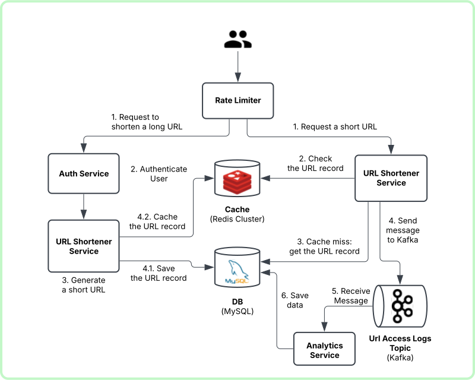

# URL Shortener - Bitly Clone

## 🚀 Introduction
- This is a **URL Shortener** system similar to Bitly. It allows users to generate short URLs from long ones and track analytics such as click counts and access details.
- 👨‍💻 Author: **Hop Do Quang** ([GitHub](https://github.com/dqh999) | [Website](https://dqhdev.com))
- Status: ``updating``

## 🛠 Tech Stack
- **Backend:** Java Spring Boot
- **Database:** MySQL
- **Cache:** Redis (for quick lookups)
- **Authentication:** JWT (for user authentication)
- **Message Queue:** Kafka (for handling analytics and logging)
- **Deployment:**
   - **Container:** Docker
   - **CI/CD:** GitHub Actions
   - **Cloud Server:** Deployed on a Cloud Server 

## 📌 Features Main
- ✅ Generate short URLs from long URLs
- ✅ Redirect short URLs to the original long URLs
- ✅ Track analytics (click count, location, user agent, etc.)
- ✅ User authentication (register, login, manage links)
- ✅ Custom short links (user-defined slugs)
- ✅ Expiry for short links

All contributions are welcome! Please feel free to fork the repository and submit pull requests.
Thank you so much! 🫶

## 📌 API Endpoints Sample

### 🔹 Shorten a URL
```http
POST /api/shortener/create
```
**Request Body:**
```json
{
  "originalUrl": "https://example.com/some-long-url"
}
```
**Response:**
```json
{
  "shortUrl": "http://localhost:8080/abc123"
}
```

### 🔹 Redirect to Original URL
```http
GET /{shortUrl}
```
**Example:**
```
GET http://localhost:8080/abc123
```
Redirects to `https://example.com/some-long-url`

### 🔹 Get Analytics for a Short URL
```http
GET /api/analytics/{shortUrl}
```
**Response:**
```json
{
  "clicks": 120,
  "created_at": "2025-02-07",
  "last_accessed": "2025-02-07T12:45:00Z"
}
```

## 🚀 Deployment
To deploy using Docker:
```sh
docker build -t url-shortener .
docker run -p 8080:8080 url-shortener
```

